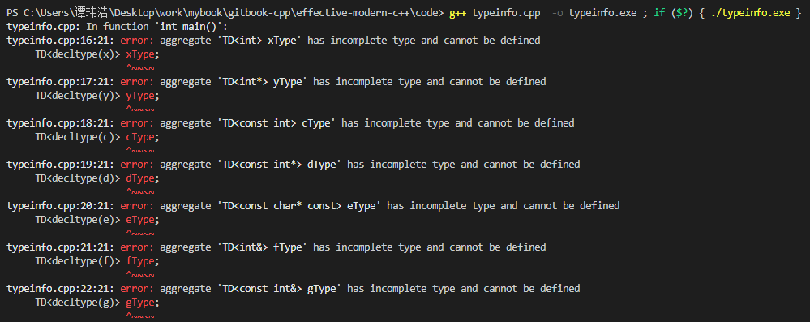

# 型别推倒

**在c++98中，只有一套型别推导规则，就是模板。但是在c++11中增加了两套，一套用于auto，一套用于decltype，在c++14中，拓宽了他们的表示范围，甚至出现了神秘的decltype(auto)这种结构。**

## 条款1：理解模板型别推导

这个条款首先介绍了c++98中，模板的推导规则，这是auto的基础。
首先给出一个例子

```c++
template<typename T>
void f(ParamType param){}

f(expr)//函数调用

template<typename T>
void f(const T& param){}
```

编译器会通过expr推导两个型别，一个是T一个是ParamType。这两个型别往往不一样，ParamType会包含一些修饰词，比如下面那个例子，ParamType为const T&。一般都会认为，T的型别推导和给定的实参是一样的，但是这里要分3中情况讨论

* ParamType 具有指针或者引用类型，但不是一个万能引用
* ParamType 是一个万能引用
* ParamType 既非指针也非引用

### 情况1：ParamType是个指针或者引用，但不是个万能引用

1. 这种情况的一般流程为，如果expr有引用性质，忽略引用性质
2. 然后对expr的型别和ParamType的型别进行模式匹配，来决定T的型别

情况1没多少坑，唯一就是引用性质的忽略。

### 情况2：ParamType是个万能引用

万能引用能够接受左值也能接受右值，所以这里和上面唯一不同的点就是，对待右值的时候，推导结果为右值，对待左值的时候，推导结果为左值。

### 情况3：ParamType 既非引用也非指针

这里其实也很好理解，这种情况就是按值专递。会忽略掉值的常量性（const）,易变性（volitile）。这就和上面有点不同。并且这里有个特殊情况时，一个指向const对象的const指针，作为实参传递。

```c++
template<typename T>
void f(T param)

const char* const ptr="Fun with points"

f(ptr)
```

在这种情况下，由于指针是按比特复制的，所以这里复制过去会将指针的const性质去掉，但是不会去掉被指字符串的常量性

### 数组实参

对于数组来说，传递参数的时候会退化为指针。所以模板并不能很好的推导数组。但是，如果是引用方式的模板，是可以完全的推导数组，并且得到长度的，这很有意思。下面代码展示应该也很清楚。

```c++
#include<bits/stdc++.h>
using namespace std;

int sz(int(&b)[13]){
    return sizeof(b)/sizeof(b[0]);
}

template<typename T,std::size_t S>
constexpr int SZ(T(&)[S]){
    return S;
}

int main(){
    int b[13]{1,2,3,4,5,6,7,8,9,10,11,12,13};
    cout<<sz(b)<<endl;
    cout<<SZ(b)<<endl;
}
```

### 函数实参

看条款感觉是正常推导，就是和数组一样会退化。

上面就是模板推导和auto推导类似的规则。

***

## 条款2：理解auto型别推导

auto型别推导其实和模板推导基本一样，就一种情况下不同。auto推导也有3种情况，在情况中的表现和模板一模一样。包括数组引用，函数引用，函数指针。

那一种不同的情况就是，c++11支持了初始化列表。使用模板是都不能推导初始化列表的,使用auto推导出来的类型是std::initializer_list<>的实例对象

```c++
auto x = {1,2,3} // x类型是initializer_list<int>

template<typename T>
void f(T param)

f({1,2,3})  //error
```

上面就是c++11和c++98关于类型推导的差异，在c++14中，允许使用auto来说明函数返回值需要被推导。在lambda函数中，也会令auto修饰参数。需要注意的是，这两个地方使用auto不是和上面的auto一个用法。这里是使用模板型别推导。

*** 

## 条款3：理解decltype

这个关键字能告诉你，对于给定的名字和表达式的型别。一般来说，他告诉你的和你预测的是一样的，通俗的说，就是不会去掉const或者volitile。也不会将引用性质去除。

decltype很准确，一般来说，它的用法在用声明哪些返回值依赖于形参的的函数。

用过STL容器的应该对operator[]这个操作符很熟悉。一般情况下，这个操作符会返回T&，但是对于vector<bool>这个对象，operator[ ]却不返回bool&而是返回一个全新的对象。下面这个代码能完成这个函数

```c++
template<typename Container,typename Index>
auto authAndAccess(Container&c,Index i) //这里auto代表返回值尾序
->decltype(c[i])
{
    return c[i];
}

//在c++14中，可以去掉尾序表达,auto直接代表推导

template<typename Container,typename Index>
auto authAndAccess(Container&c,Index i){
    return c[i];
}

//还可改进，auto代表类似模板的自动类型推导，auto类型推导将剥夺引用修饰词，这么一来返回值会成为int而不是int&
//我们刚刚有完整推导的工具，那就是decltype

template<typename Container,typename Index>
decltype(auto) authAndAccess(Container&c,Index i){
    return c[i];
}

//还可改进，这里使用引用，就只能接受左值，但是又时候想接受右值，这里改为万能引用,对于万能引用要使用std::forward完美转发

template<typename Container,typename Index>
decltype(auto) authAndAccess(Container&&c,Index i){
    return std::forward<Cotainer>(c)[i];
}
```

最后还需要了解decltype的一点是，如果应用于一个名字之上，就返回这个名字的类型，如果稍微复杂的表达式，就会返回一个T&类型。下面表达式就会返回错误的结果

```c++
int x=0;

decltype(auto) f1(){
    int x;
    return x;       //这里返回类型是int
}

decltype(auto) f1(){
    int x;
    return (x);     //这里返回类型是int&，返回一个临时变量的引用存在问题
}
```

所以最后要说明的是，使用decltype(auto)有时候可能会有意想不到的结果

***

## 条款4：掌握查看类别推导结果的方法

上面说了这么多类型推导，那我们又如何知道类型到底是啥呢，通过什么可以看出来呢。这里可以3种方法

* IDE一般的IDE都会动态分析类型
* 编译器诊断信息
* 利用typeid和typeinfo

这里主要介绍一下编译器诊断信息，也就是我们自己出错，看编译器信息，使用如下代码就行

```c++
#include<bits/stdc++.h>
using namespace std;

template<typename T>
class TD;

int main(){
    int x;
    int* y;
    const int c=5;
    const int* d=&x;
    const char* const e="adsf";
    int& f=x;
    const int& g=x;

    TD<decltype(x)> xType;
    TD<decltype(y)> yType;
    TD<decltype(c)> cType;
    TD<decltype(d)> dType;
    TD<decltype(e)> eType;
    TD<decltype(f)> fType;
    TD<decltype(g)> gType;
}
//编译之后看报错信息就可以知道具体的推导类型
```
