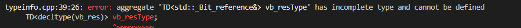

# auto

**上一个条款也有谈到auto，auto看起来很简单，但是还是有些情况需要注意。这里主要讲如何去引导auto得出正确的结果**

## 条款05：优先选用auto，而非显示型别声明

这个条款给出几个理由，让我们优先选择使用auto。下面几个例子可以展示

```c++
int x;      //忘记初始化

template<typename It>
void dwim(It a,It b){
    while(a!=b){
        typename std::iterator_traits<It>::value_type
            currValue = *b;         //定义又臭又长
    }
}

auto x=5;   //必须初始化

template<typename It>
void dwim(It a,It b){
    while(a!=b){
        auto currValue = *b;         //只需要auto即可
    }
}

//一般是有lambda的时候都是用auto，不然你拿捏不了型别

auto func=[](int a,int b){return a==b;};
auto func_auto=[](auto a,auto b){return a==b;};

//不用auto也是可以声明lambda表达式的，可以用std::function，但是会啰嗦，以及占用更多的内存。

function<bool(const std::unique_ptr<Widget>&,
                const std::unique_ptr<Widget>&)>
        dereFUPLess = [](const std::unique_ptr<Widget>&p1,
                const std::unique_ptr<Widget>&p2){return *pa<*p2;};
//可以看到，上面的声明巨麻烦，并且std::function会占用更多的内存
```

上面主要讲的是auto的便利，下面一个例子能体现使用auto的更大的好处。

```c++

std::unordered_map<std::string,int> ma;

for(const std::pair<std::string,int>&p:ma){
    //do something
}

```

可以看到，大家应该都觉得这里没啥问题。但是map的key是默认const的。也就是这里真实的构造其实是 const std::pait<const std::string,int>,这里不匹配，要执行编译器强制转换。将所有的key复制一遍。开销巨大。可能有时候你写出这种代码，自己都不知道哪里出了问题。使用auto的话，这里什么问题都不会存在了。


***

## 当使用auto推导的型别不符合要求的时候，使用带显式型别的初始化物习惯用法

有些方法返回的不是你所想的结果。因为有些类被设计为代理类，返回值可以隐式转换到你认为的结果。但是使用auto却不可以，auto会为你推导出本来的结果。vector< bool >中operator[]就是一个典型的例子，他返回值不是bool&，如果用auto接收，就会出乎你的意料。使用上一节末尾的编译器识别类型，得出vector< bool >中operator[]返回的结果类型为


可以看到，类型是std::_Bit_reference&，这个类型我相信大家应该都没用过。

这个条款说的就是，有的时候还是使用显式声明比较好。但这不是说不用auto，还是建议使用auto，因为这种情况不多。