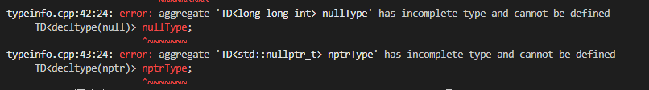

# 转向现代c++

这个章节主要讲的就是c++11和c++14的一些小的新特性。

## 条款7：在创建对象的时候注意区分{}和()

首先要注意的一点是，大括号语法应用最广泛，并且还可以阻止隐式窄化转型，还能对解析语法免疫。当然它还有很多问题。

最需要注意的就是，如果构造函数有初始化列表，那么编译器会千方百计首先满足初始化列表。实在不行才会退一步，使用普通构造函数，看下面例子。

```c++
class Widget{
public:
    Widget(int i,bool b);
    Widget(int i,duuble b);
    Widget(std::initializer_list<long double> il);
}

Widget w1(10,true); //使用小括号，调用的是构造函数
Widget w1{10,true}; //调用的是初始化列表构造函数，10和true都被强制转化为long double

//这里即使是移动构造函数都可能被初始化列表劫持

//另外一个关键问题就是，如果传入参数一样，但是因为括号原因导致调用了不同的构造函数，这是不好的设计
//最熟悉的vector就有这种设计，看下面的例子

vector<int> v1(10,2)    //创建一个大小为10，元素都是2的vector
vector<int> v2{10,2}    //创建一个大小为2，两个元素是10和2的vector
```

***

## 条款8：优先选用nullptr，而非0或者NULL

在原来的语言中，空指针被认定为是0，NULL也代表空指针，所以也是0.NULL比较特殊。各个平台实现不一样。这就导致NULL很多时候被定义为int类型，或者是其他的整数类型。但是nullptr不会，nullptr是带有指针性质的。

依然是用之前用的编译器自动推导代码，我们推导NULL和nullptr在平台到底是如何实现的。代码和输出如下：

```c++
#include<bits/stdc++.h>
using namespace std;

template<typename T>
class TD;

int main(){
    auto null=NULL;
    auto nptr=nullptr;

    TD<decltype(null)> nullType;
    TD<decltype(nptr)> nptrType;
}
```


可以看到，nullptr的类型是std::nullptr_t，但是NULL的类型是long long int.

***

## 条款9：优先选用别名声明，而非typedef

很多情况下typedef和using区别不大。但是有using可以用于模板，而typedef就差了一些，看下面一些例子。

```c++
template<typename T>
using MyAllocList = std::list<T,MyAlloc<T>>;

MyAllocList<Widget> lw;

template<typename T>
class MyAllocList{
    typedef std::list<T,MyAlloc<T>> type;
}

MyAllocList<Widget>::type lw;
```

更有甚者，在一些情况下，要求在前面写上typename，这个条款之后就涉及到模板元编程，这个在more effective c++中也有提到，我还没看到，就不深入了

最后，这个条款的要点就是，尽量使用using而不是typedef

***

## 条款10：优先选用限定作用域的枚举类型，而非不限作用域的枚举类型

这里对枚举进行说明，主要讲了下面几点。

* c++98风格的枚举型别，现在称为不限范围的枚举型别
* 限定作用域的枚举型别仅在枚举型别内可见。只能通过强制类型装换以转换至其他型别
* 限定作用域的枚举型别和不限作用域的都支持底层型别。限定作用域的是int而不限作用域的没有默认的底层型别
* 限定作用域的枚举型别可以进行前置声明，而不限范围的枚举只有在支持底层类型的时候才能进行前置声明

***

## 条款11：优先选用删除函数，而非private未定义函数

我们知道编译器会在需要的时候自动给类增加一些函数。最常见的就是复制构造函数和复制运算符。在c++11中还加入了移动构造函数和移动运算符。

在c++98的时候，都是把这些定义为private函数，不去实现，那么用户是用户是用不到这些函数了。但是还是有一些函数能够访问他们，比如友元，成员函数。在c++11中加入了=delete来说明这个函数为删除函数。

删除函数的好处不仅仅是构造这种成员函数，删除函数还能用于非成员函数。一把这种情况是防止隐式转换。自己定义的类型可以用禁止隐式转换。但是c++的基本类型，是默认可以隐式转化的。比如char转为int或者bool转为int。如果想防止这些调用产生。可以将成员函数删除，来达到这种效果。

***

## 条款12：为意在改写的函数添加override声明

使用虚函数实现多态在c++中已经是一种人人都需要掌握的知识了。但是很多人对细节不是很清楚。不知道自己的书写方式会不会导致虚函数被重写，下面的例子中的4个函数，虚函数都没被重写

```c++
class Base{
public:
    virtual void mf1() const;
    virtual void mf2(int x);
    virtual void mf3() &;
    void mf4() const;
}

class Derived:public Base{
public:
    virtual void mf1(); //没有加const
    virtual void mf2(unsigned int x);   //参数对不上
    virtual void mf3() &&;  //base带有左值引用饰词而这里是右值引用饰词
    void mf4() const;   //没有加virtual，不是多态二是隐藏
}
```

这些错误，编译器都会默默吞下，只有当你运行的时候，你才会发现，为什么没有按照你要的行为运行。但是在后面加上override关键字之后。这些问题都不存在了，编译器会去检查你是否重写成功

这里还要注意的是成员函数的修饰词，后面又一个&的是左值引用，后面是&&的是右值引用。如果使用修饰词限定之后，只能通过限定的对象调用他们

***

## 优先选用const_iterator，而非iterator

使用const_iterator的理由和平常使用const的理由是一样的。只要没有改变这个对象，就使用const修饰。c++98是支持迭代器的，也支持const_iterator。但是支持的不全面。没有直接得到const_iterator的方法。很多情况下只能通过普通的iterator转型。

在c++11中，提供了新的iterator访问函数。比如cbegin，cend,rbeing,rend。等等，能直接支持得到const_iterator以及其他迭代器的成员函数。


***

## 只要函数不会发射异常，就为其加上noexcept声明

这个条款指出noexcept很重要，对于他所修饰的函数来说，他和const一样重要。也就是说，如果有noexcept性质，那就一定要给函数加上noexcept关键字。

再来说这个关键字的好处。在c++98中，是支持异常的，使用throw来显示函数会抛出或者不抛出异常。使用try catch语句来捕获异常。但是对于异常来说，碰到异常会导致栈退解。也就是try语句中，以及try语句调用的函数中的所有对象都会按照构造顺序析构。直到try语句块中。

这就要求编译器必须在碰到异常的时候，保存所有调用状态。但是如果使用noexecpt是可以保证可能不会栈退解，这就给编译器优化函数的余地。有更多机会得到优化。

noexcept性质对swap和移动操作是最有价值的。考虑在vector中存放一个你定义的对象，push_back的时候，如果你希望是通过移动构造函数push，那很好，说明你很好的利用了c++11的新特性，但是，需要注意的是。vector的push_back接口是异常安全的。在vector容量不够的时候，vector会开两倍的内存并且将之前的都复制过去。如果对象支持移动，则移动过去是很美好的。但是如果移动过程中抛出异常。那就需恢复到原来的状态。对于复制来说，是很好操作的，因为先将所有的复制过去。然后才会析构。但是对于移动来说，移动过去之后，就不能再回到原来的状态了。所以STL容器一般都规定。只有当移动构造函数是noexcept的时候，才使用移动，否则不使用。

所以noexcept有时对性能提高还是很重要的。

还需要注意的就是，很多函数都是中立的。如果没有noexcept性质，不要盲目加上，和const很像。

***

## 条款15：只要有可能使用constexpr，就使用它

这个性质和const也很像，哈哈。

首先看到这个constexpr的时候，我也很懵。首先需要知道的是，constexpr肯定是const对象。他是个加强版本的const，除了拥有const性质，他修饰的值是在编译器可见的。但是这种说法并不完全。如果constexpr修饰的是函数，那就大一不一样了。constexpr修饰的函数并不保证有const性质以及编译期可知的性质。如果传入的参数是编译器可知的实参，那么返回的结果也就是编译期可知的。这个意思也就是，constexpr修饰的函数可以有两种用处，一种当编译期已知的函数使用，另一种是普通函数。

由于constexpr在传入编译期常量的时候，能够返回编译期结果。必须对其加以限制。在c++11和c++14中，这种限制还有所不同。在c++11中，constexpr函数只能有一行，也就是直接return，但是c++14中，这种限制被解除。下面这个代码在c++14中是能编译的，但是c++11不行

```c++
#include<bits/stdc++.h>
using namespace std;

constexpr int a(int b){
    b=b+1;
    return b;
}

int main(){
    cout<<a(8)<<endl;
}
```

常见的字面值就是内置类型，但是自定义的对象也可以成为字面值。只要构造函数和调用的成员函数带有constexpr即可。

***

## 条款16：保证const成员函数的线程安全性

这个条款主要讲的就是并发。如何消除const函数内的race condition。消除办法有使用atomic变量和使用互斥量mutex。mutex开销比较大，但是atomic值适用于单个变量的情况。需要注意的是，使用了这两个之后，对象就不允许被复制了，只能被移动。

***

## 条款17：理解特种成员函数的生成机制

这个条款首先给我回顾了一下古老的c++98，特种函数自动生成机制。也就是大家都熟知的默认构造函数，析构函数，复制构造函数，复制运算符。

在c++11中，加入了很重要的移动构造函数和移动赋值操作符。他们的自动生成又有什么机制呢，之前我也一直没在意，这个条款帮我理清了，首先说下结论，然后把例子列一下：

* 默认构造函数：c++11和c++98相同。仅当类中不包含用户声明的构造函数的时候才生成
* 析构函数：c++11与c++98机制基本相同，唯一区别就是c++11自动生成的析构函数是noexcept。与c++98相同，只有基类析构函数是虚的情况下，派生类析构函数才是虚的。
* 复制构造函数：运行期和c++98一样：按成员进行非静态数据成员的复制构造。仅当类中没有自己定义的复制构造函数的时候生成，在类定义了移动构造函数的时候，复制构造函数将会被删除。在已经存在复制赋值运算符的情况下，仍然生成复制构造函数是一种被废弃的行为
* 复制赋值运算符：和上面复制构造函数一样。
* 移动构造函数和移动赋值运算符：都按成员进行非静态数据成员的移动操作。仅当类中不包含用户什么的复制操作，移动操作和析构函数时才生成

再介绍一下大三律：如果你声明了复制构造函数或者复制运算符或者析构函数中的一个，就得同时声明他们3个。因为只要声明了一个，说明类中的数据是不能被默认管理的。3个都要声明。延伸到c++11中的移动操作，也是这样。c++11在生成时，默认了如果定义其他的就不为它生成默认移动操作。这里要多用default关键字。来提醒编译器生成需要的函数  

